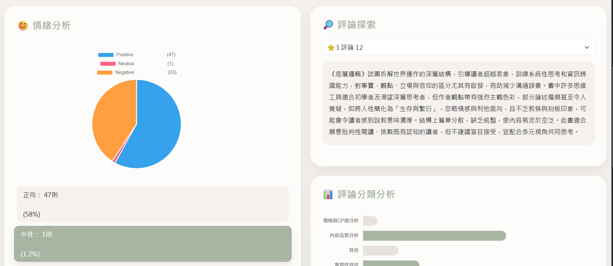
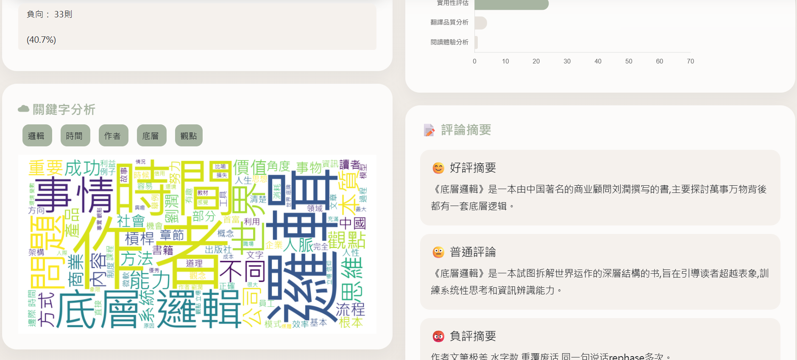
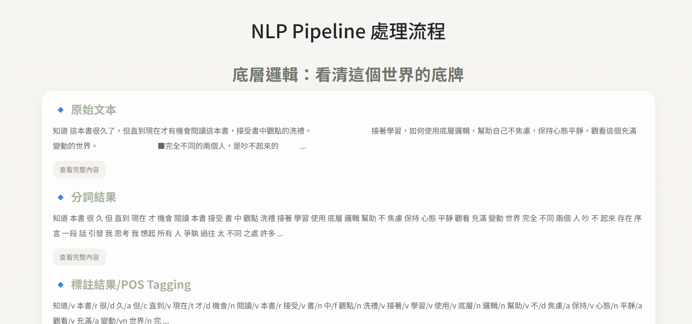
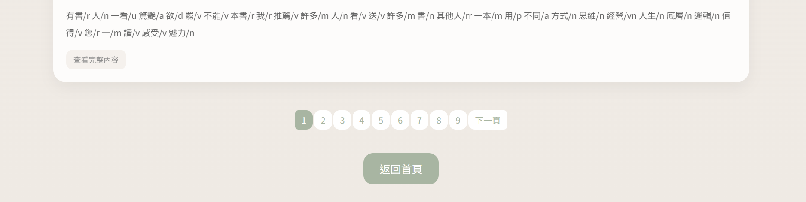

# InsightBooks-NLP-Book-Review-Analyzer

# 博客來評論分析 NLP 系統

本專案以 **自然語言處理（NLP）** 技術分析博客來書籍評論，協助使用者快速理解書籍評價特徵，並提供讀者更具參考價值的分析結果。

系統整合 **評論爬蟲、文字前處理、情緒分析、自動摘要、關鍵字分析與文字雲視覺化**，並透過 Flask 建立網頁介面，提供互動式分析功能。

---

## 功能特色

- ✅ 博客來評論爬蟲
- ✅ 前處理 / 中文分詞 / 詞性標註
- ✅ 自動摘要（好評 / 普通評論 / 負評）
- ✅ Azure 情緒分析
- ✅ 關鍵字分析
- ✅ 文字雲視覺化
- ✅ NLP Pipeline 檢視頁面
- ✅ 預設書籍分析

---

## 系統流程

```text
博客來評論
    ↓
評論爬蟲
    ↓
資料前處理
(清理 / 分詞 / 詞性標註)
    ↓
 ┌───────────────┬──────────────┬───────────────┐
 ↓               ↓              ↓
情緒分析       自動摘要       關鍵字分析
 ↓               ↓              ↓
百分比圖表     評論摘要       文字雲
```

---

## 系統展示

### 首頁

首頁分析介面：





### NLP Pipeline

評論前處理與分頁展示：



---

## 專案結構

```text
博客來評論分析NLP2/

app.py

templates/
│
├── index.html
├── pipeline.html
│
└── components/
    ├── navbar.html
    ├── hero.html
    ├── search_card.html
    ├── emotion_card.html
    ├── keyword_card.html
    ├── explorer_card.html
    ├── classification_card.html
    └── summary_card.html

static/
│
├── css/
│   ├── style.css
│   └── pipeline.css
│
├── js/
│   └── main.js
│
└── images/
    └── hero-book.png

data/

input_crawler.py
preprocessing.py
sentiment_analysis.py
keyword_extraction2.py
text_classification.py
summarization.py

│── requirements.txt
│── .env
│── README.md
```

---

## 使用技術

### 後端

- Flask
- Pandas
- Requests
- BeautifulSoup4

### NLP

- Jieba
- NLTK
- SnowNLP
- Azure AI Text Analytics

### 視覺化

- WordCloud
- Matplotlib

### 爬蟲

- Selenium
- webdriver-manager
- undetected-chromedriver

---

## 安裝方式

建立虛擬環境：

```bash
python -m venv venv
```

啟動虛擬環境：

Windows：

```bash
venv\Scripts\activate
```

安裝套件：

```bash
pip install -r requirements.txt
```

---

## 環境變數設定

建立 `.env`

```env
AZURE_LANGUAGE_ENDPOINT=YOUR_ENDPOINT
AZURE_LANGUAGE_KEY=YOUR_KEY
```


---

## 執行方式

啟動 Flask：

```bash
python app.py
```

開啟：

```text
http://127.0.0.1:5000
```

---

## 預設分析書籍

系統目前提供以下預設書籍：

- 原子習慣
- 牧羊少年奇幻之旅
- 解憂雜貨店
- 被討厭的勇氣
- 底層邏輯：看清這個世界的底牌

---

## 分析結果

系統提供：

### 評論摘要

依評分區分：

- 好評（4★以上）
- 普通評論（3★以上～4★）
- 負評（3★下）

### 情緒分析

顯示：

- Positive
- Neutral
- Negative

並提供：

- 評論數量
- 百分比統計

### 關鍵字分析

輸出：

- 高頻關鍵字
- 中文文字雲

---

